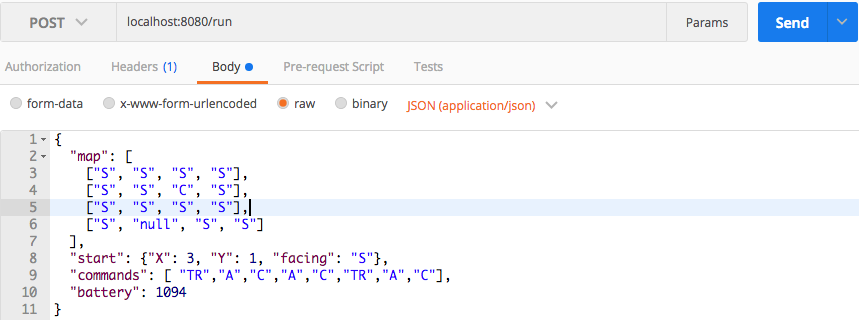

# RobotRunnerServiceClient

# Test and Run with Spring Boot
For test with Spring Boot you need to run this command:

`mvn clean install`

Find the generated jar in the `target` folder and run this as follows:

`java -jar RobotRunnerServiceClient-0.0.1-SNAPSHOT.jar`

You can run the service in a specific port if you want, adding this at the end of the command:

`--server.port={portNumber}`

After run the service, you can send a HTTP POST to this route:

`localhost:{portNumber}/run`

Specifying in the body (of type "application/json") the json input
of the robot and this will return another json with the response.

Here is an image of an example, running this from Postman:

# Example

# Test and Run with Docker

For test the service with Docker you first have installed Docker on your machine.

For test the service on you local machine you need run Docker Registry container with this command in a port:

`docker run -d --name registry -p portNumber:portNumber registry:latest`

Run this command in the project, this will build tha Docker's image:

`mvn install dockerfile:build`

Now you need to tag and publish the image into the loca repository, with this command:

`docker tag ${userName}/robotrunnerserviceclient:0.0.1 localhost {portDockerRegistry}/${userName}/robotrunnerserviceclient:0.0.1`

`docker push localhost:portDockerRegistry/${userName}/robotrunnerserviceclient:0.0.1`

And finally you need to run the docker image with this command:

`docker run -p 8080:8080 -t localhost:{portDockerRegistry}/${userName}/robotrunnerserviceclient:0.0.1`

You should see now the logs from Spring Boot that the service is running.
